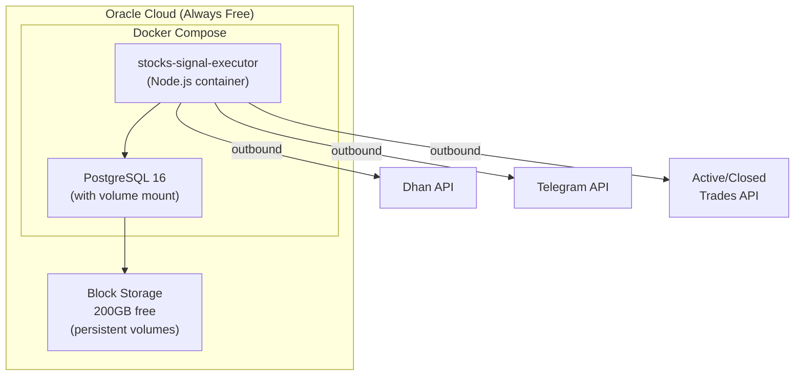

# Deployment Plan — stocks-signal-executor

## The Problem

Your app is a **long-running Node.js polling bot** (1-hour interval) that requires:

- Persistent **Postgres** database (trades, audit logs, PnL, tokens)
- Outbound HTTP to Dhan API, Active/Closed Trades APIs
- Telegram bot (long-polling via `telegraf`)
- Runs continuously during market hours

---

## Why Cloudflare Workers/D1 Won't Work (Free Tier)

> [!CAUTION]
> **Cloudflare Workers free tier is fundamentally incompatible with this application.**

| Constraint             | Workers Free Tier                 | Your App's Needs                                |
| ---------------------- | --------------------------------- | ----------------------------------------------- |
| CPU time per request   | **10 ms**                         | Continuous polling loop                         |
| Execution model        | Short-lived, event-driven         | Long-running process                            |
| Database               | D1 (SQLite) — 500MB, 5M reads/day | Postgres with JSONB, `BIGSERIAL`, `TIMESTAMPTZ` |
| WebSockets / long-poll | Limited                           | Telegram `telegraf` needs it                    |
| Cron minimum           | 1 min (paid only)                 | 1hr polling ✅ (but moot — see above)           |

**Cloudflare Containers** ($5/mo minimum, paid plan required) could technically work but violates the zero-cost constraint. Disks are also ephemeral — database data would be lost.

---

## Recommended Architecture: Oracle Cloud Free Tier + Docker

> [!IMPORTANT]
> This is the only architecture that satisfies **all** your requirements: zero cost, persistent data, static IP, Docker support, and future cloud portability.



### Why Oracle Cloud Free Tier?

| Resource         | Oracle Always Free                    | Cost |
| ---------------- | ------------------------------------- | ---- |
| ARM A1 VM        | **4 OCPU, 24 GB RAM**                 | $0   |
| Boot volume      | 200 GB total                          | $0   |
| Static Public IP | 1 Reserved Public IP                  | $0   |
| Outbound data    | 10 TB/month                           | $0   |
| Availability     | **No time limit** (truly always-free) | $0   |

> [!NOTE]
> Oracle may reclaim **idle** instances (not used for 7 days). Your app polls every hour + Telegram bot runs continuously, so it will never be idle.

---

## Static IP Options (Free)

| Provider                       | Free Static IP?                                 | Notes                                  |
| ------------------------------ | ----------------------------------------------- | -------------------------------------- |
| **Oracle Cloud** (recommended) | ✅ 1 Reserved Public IP                         | Best option — truly free, no expiry    |
| **GCP** (e2-micro)             | ⚠️ Free only while attached to running instance | Only 1GB RAM; IP charges if VM stopped |
| **AWS** (t2.micro)             | ❌ $3.6/yr after 12 months                      | IPv4 charges since Feb 2024            |

**Recommendation**: Use **Oracle Cloud's Reserved Public IP**. Simple, free, no expiry.

---

## Data Persistence Strategy

> [!IMPORTANT]
> Even if everything is stopped, database data will NOT be lost.

### Docker Volumes on Persistent Block Storage

```yaml
# docker-compose.prod.yml
volumes:
  postgres-data:
    driver: local # Maps to Oracle's persistent block storage
```

### Backup Strategy (Zero Cost)

| Layer              | Method                                       | Frequency    |
| ------------------ | -------------------------------------------- | ------------ |
| **Postgres**       | `pg_dump` cron → local file + R2 (10GB free) | Daily        |
| **Docker volumes** | Oracle block storage snapshots (5 free)      | Weekly       |
| **Schema**         | Version-controlled in `db/schema.sql`        | Every commit |

```bash
# Example daily backup cron (add to host crontab)
0 20 * * * docker exec stocks-executor-postgres \
  pg_dump -U postgres stocks_executor | gzip > /backups/db-$(date +%F).sql.gz
```

### If You Delete the Oracle VM

> [!WARNING]
> Deleting the ARM A1 instance will destroy all Docker volumes (including the database) **unless** you take one of these steps:

1. **Preserve boot volume** — When terminating via Oracle Console, **uncheck** "Permanently delete the attached boot volume". The disk survives and can be attached to a new VM. (Free within 200GB limit.)
2. **Off-VM backup** — Periodically pull `pg_dump` backups to your local machine:
   ```bash
   scp -i ~/.ssh/oracle_key ubuntu@<VM_IP>:~/stocks-signal-executor/backups/db-*.sql.gz ~/local-backups/
   ```

---

## Docker: Yes, Use It

> [!TIP]
> You already have a working `Dockerfile` and `docker-compose.yml`. Docker is the right choice here.

### Why Docker is Right

1. **You already have it** — `Dockerfile` (multi-stage) + `docker-compose.yml` are ready
2. **Cloud portability** — same compose file works on Oracle, GCP, AWS, Hetzner, or your laptop
3. **Data isolation** — named volumes survive container restarts, upgrades, and redeployment
4. **Reproducible** — no "works on my machine" issues

### Production docker-compose Changes Needed

Your current `docker-compose.yml` targets the `builder` stage (dev mode with `nodemon`). For production:

```diff
 services:
   stock_app:
     build:
       context: .
-      target: builder
+      # Uses final 'runner' stage (production)
-    command: ["sh", "-lc", "[ -d node_modules ] || npm ci; npm run dev:watch"]
+    command: ["node", "dist/index.js"]
+    restart: always
-    volumes:
-      - .:/app
-      - node_modules:/app/node_modules

   stock_postgres:
     # ... same as current ...
+    restart: always
```

---

## Do You Need Terraform / Ansible?

### Short Answer

| Tool               | Need Now?       | When to Add                                                          |
| ------------------ | --------------- | -------------------------------------------------------------------- |
| **Terraform**      | ❌ Not yet      | When you want to spin up infra on a different cloud with one command |
| **Ansible**        | ❌ Not yet      | When you have > 1 server or want automated OS-level config           |
| **Docker Compose** | ✅ Already have | Sufficient for single-server deployment                              |

### Longer Answer

> [!NOTE]
> For a **single-server, single-app** deployment, Docker Compose is sufficient. Terraform and Ansible add complexity without benefit at this scale.

**Terraform** (Infrastructure as Code):

- Useful when: you want to recreate the Oracle VM + networking + firewall rules from code
- Benefit: if Oracle reclaims your instance, `terraform apply` rebuilds everything
- When to add: when you're ready for a second environment (staging) or want to move to GCP/AWS
- Effort: ~2 hours to write Oracle Cloud provider config

**Ansible** (Configuration Management):

- Useful when: you need to install Docker, configure firewall, set up cron backups on the VM
- When to add: when you have > 1 server or want fully automated provisioning
- Alternative now: a simple `setup.sh` script does the same for one server

### Cloud Portability Plan (Future-Proofing)

Since you want the ability to change cloud providers:

```
Current State (you are here):
  └── Docker Compose → works on ANY Linux server

Future State (when needed):
  └── Terraform (infra) + Docker Compose (app) + Ansible (config)
      ├── terraform/oracle/  ← current
      ├── terraform/gcp/     ← future
      └── terraform/aws/     ← future
```

The key portability layer is **Docker Compose** — which you already have. The app doesn't care what cloud it's on.

---

## Deployment Steps (Manual, One-Time)

### 1. Provision Oracle Cloud VM

```bash
# Sign up at https://cloud.oracle.com (free tier)
# Create ARM A1 instance: 2 OCPU, 12 GB RAM (leave room for future)
# Select Ubuntu 22.04 or 24.04 ARM image
# Reserve a Public IP and attach it
```

### 2. Setup the VM

```bash
# SSH into the VM
ssh -i ~/.ssh/oracle_key ubuntu@<YOUR_STATIC_IP>

# Install Docker
curl -fsSL https://get.docker.com | sh
sudo usermod -aG docker $USER

# Clone your repo
git clone <your-repo-url> ~/stocks-signal-executor
cd ~/stocks-signal-executor

# Create .env from .env.example and fill in secrets
cp .env.example .env
nano .env
```

### 3. Deploy

```bash
# Build and start
docker compose -f docker-compose.prod.yml up -d --build

# Verify
docker compose logs -f stock_app
```

### 4. Setup Daily Backups

```bash
# Add cron job for daily Postgres backup
crontab -e
# Add: 0 20 * * * /home/ubuntu/stocks-signal-executor/scripts/backup.sh
```

---

## Cost Summary

| Service              | Usage             | Cost         |
| -------------------- | ----------------- | ------------ |
| Oracle Cloud ARM VM  | 4 OCPU, 24 GB RAM | **$0**       |
| Oracle Block Storage | 200 GB            | **$0**       |
| Oracle Static IP     | 1 Reserved        | **$0**       |
| Oracle Egress        | 10 TB/mo          | **$0**       |
| **Total**            |                   | **$0/month** |

---

## Summary of Recommendations

| Question                   | Answer                                                           |
| -------------------------- | ---------------------------------------------------------------- |
| Use Cloudflare Workers/D1? | **No** — incompatible with long-running process + Postgres       |
| Use Docker?                | **Yes** — you already have it, and it provides cloud portability |
| Need Terraform?            | **Not yet** — add when switching clouds or adding environments   |
| Need Ansible?              | **Not yet** — a setup script suffices for one server             |
| Where to host?             | **Oracle Cloud Always Free** (ARM A1)                            |
| Static IP?                 | **Oracle Reserved Public IP** (free)                             |
| Data persistence?          | **Docker volumes** on persistent block storage + daily `pg_dump` |

# One-time setup script for Oracle Cloud ARM VM (Ubuntu 22.04/24.04)

# Download and run setup script (installs Git, Docker, clones repo, configures firewall & backup cron)

`curl -fsSL https://raw.githubusercontent.com/Chandan4862/stocks-signal-executor/main/scripts/setup.sh -o setup.sh
sudo bash setup.sh`
