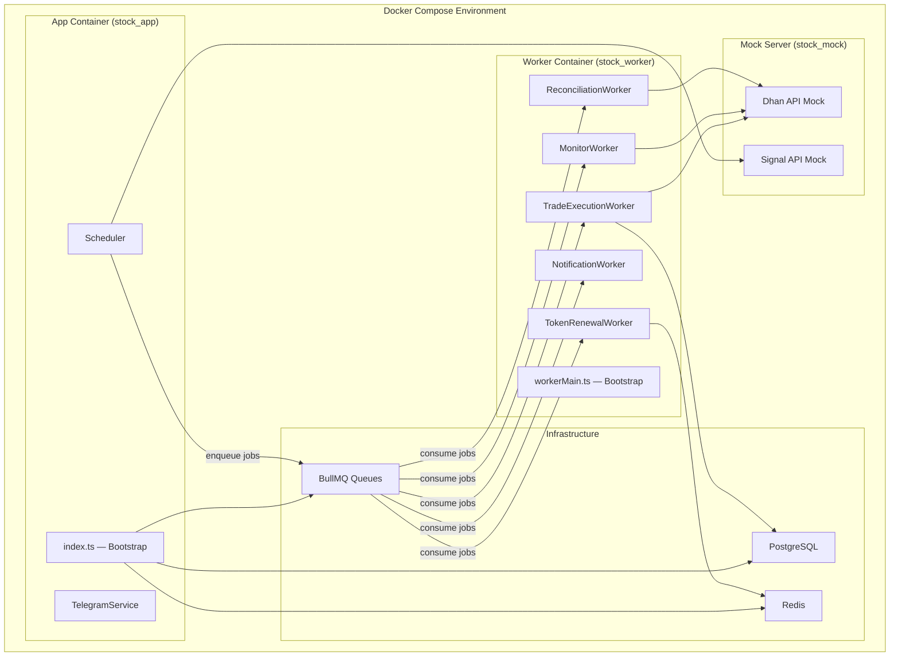
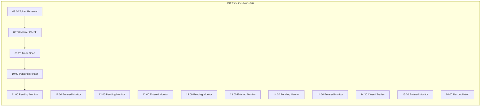
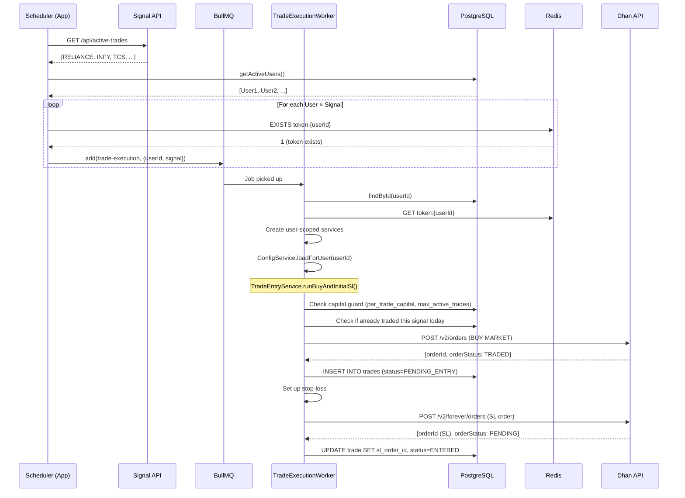
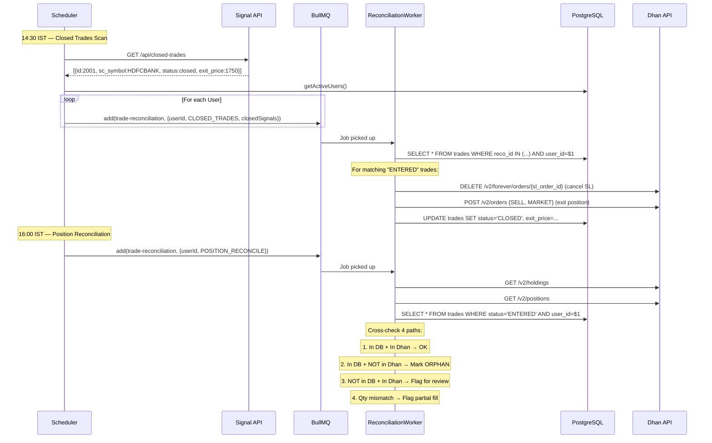
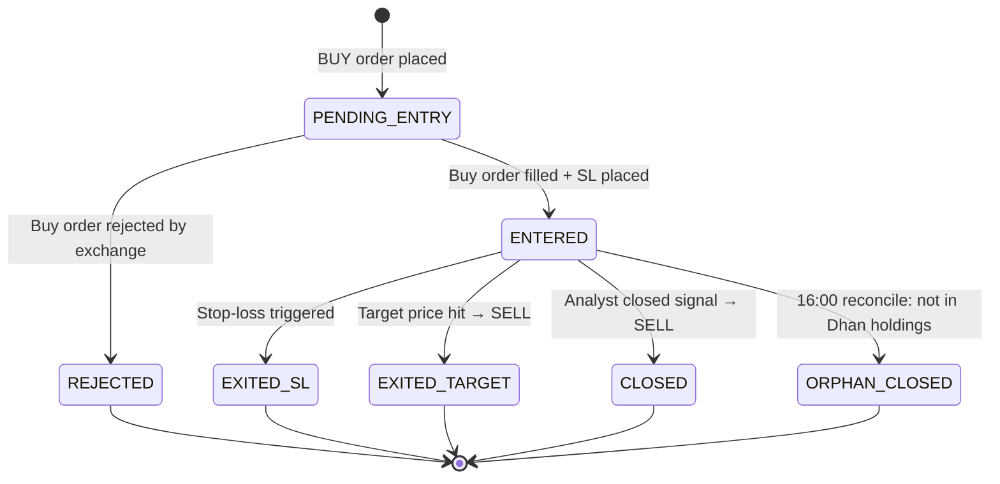

# Application Lifecycle Flowchart

## Architecture Overview



---

## Phase 1: Application Startup

### App Process ([index.ts](file:///Users/chandan/workspace/stocks-signal-executor/src/index.ts))

```
┌──────────────────────────────────────────────────────────────┐
│                      main() entry point                       │
└──────────────────────────┬───────────────────────────────────┘
                           ▼
              ┌────────────────────────┐
              │  1. loadConfig()       │  ← parse + validate env vars (Zod)
              │     → AppConfig        │    PG_*, REDIS_*, TELEGRAM_*, DHAN_*
              └────────────┬───────────┘
                           ▼
              ┌────────────────────────┐
              │  2. StateStore(config)  │  ← pg.Pool with max=30 connections
              │     → store.connect()  │    Verifies PG connectivity
              │     ✅ Postgres pool   │
              └────────────┬───────────┘
                           ▼
              ┌────────────────────────┐
              │  3. getRedis(config)   │  ← ioredis singleton
              │     ✅ Redis connected │    maxRetriesPerRequest: null (for BullMQ)
              └────────────┬───────────┘
                           ▼
              ┌────────────────────────┐
              │  4. createQueues(redis)│  ← 6 BullMQ queues created:
              │                        │    signal-fanout, trade-execution,
              │                        │    trade-monitor, trade-reconciliation,
              │                        │    notification, token-renewal
              │     ✅ 6 queues        │
              └────────────┬───────────┘
                           ▼
              ┌────────────────────────┐
              │  5. TelegramService()  │  ← Telegraf bot instance
              │     AuditLogService()  │    PG-backed audit + Telegram alerts
              └────────────┬───────────┘
                           ▼
              ┌────────────────────────┐
              │  6. ConfigService()    │  ← Load global config from app_config table
              │     → configSvc.load() │    Cache all key/value pairs in memory
              │     → setConfigService │    Inject into TelegramService
              └────────────┬───────────┘
                           ▼
              ┌────────────────────────┐
              │  7. TokenService()     │  ← For legacy single-user /token /renew commands
              │     → setTokenService  │
              │     → setAudit         │
              └────────────┬───────────┘
                           ▼
              ┌────────────────────────┐
              │  8. Multi-tenant setup │
              │     UserRepository     │  ← PG pool for user queries
              │     CredentialVault    │  ← AES-256-GCM encryption (MASTER_ENCRYPTION_KEY)
              │     UserService        │  ← Business logic for user management
              └────────────┬───────────┘
                           ▼
              ┌────────────────────────┐
              │  9. Telegram handlers  │
              │     UserResolver MW    │  ← Extracts user from Telegram ctx
              │     OnboardingHandler  │  ← /register, /setup_broker, /setup_totp
              │     TradingHandler     │  ← /enable, /disable, /status, /monitor
              │     ConfigHandler      │  ← /config (per-user overrides)
              │     → setMultiUserHandlers()
              └────────────┬───────────┘
                           ▼
              ┌────────────────────────┐
              │ 10. Scheduler()        │  ← Enqueue-only model
              │     → scheduler.start()│    Sets up all IST time-based timers
              └────────────┬───────────┘
                           ▼
              ┌────────────────────────┐
              │ 11. telegram.launch()  │  ← Start Telegraf long-polling
              │     PostbackService()  │  ← Optional webhook server
              └────────────┬───────────┘
                           ▼
              ┌────────────────────────┐
              │ 12. Graceful shutdown  │  ← SIGINT / SIGTERM handlers
              │     → scheduler.stop() │    Stop timers → close queues →
              │     → telegram.stop()  │    stop bot → disconnect PG/Redis
              │     → store.disconnect │
              └────────────────────────┘
```

### Worker Process ([workerMain.ts](file:///Users/chandan/workspace/stocks-signal-executor/src/workerMain.ts))

```
┌──────────────────────────────────────────────────────────────┐
│                    workerMain() entry point                    │
└──────────────────────────┬───────────────────────────────────┘
                           ▼
              ┌────────────────────────┐
              │  1. loadConfig()       │  ← Same config as app
              └────────────┬───────────┘
                           ▼
              ┌────────────────────────┐
              │  2. pg.Pool (max=30)   │  ← Separate connection pool
              │     → verify connect   │
              └────────────┬───────────┘
                           ▼
              ┌────────────────────────┐
              │  3. 6× Redis conns     │  ← BullMQ needs separate conn per worker
              │     tradeExecConn      │    (one per worker + one for queue)
              │     monitorConn        │
              │     reconConn          │
              │     notifConn          │
              │     tokenConn          │
              │     queueConn          │
              └────────────┬───────────┘
                           ▼
              ┌────────────────────────┐
              │  4. Create 5 workers   │
              │     TradeExecution     │  concurrency=5, limiter=5/s
              │     Monitor            │  concurrency=5, limiter=5/s
              │     Reconciliation     │  concurrency=5, limiter=5/s
              │     Notification       │  concurrency=10
              │     TokenRenewal       │  concurrency=3
              │     ✅ Listening on    │
              │        all queues      │
              └────────────────────────┘
```

---

## Phase 2: Scheduler — Daily Cadences



### Detailed Schedule

|   Time (IST)    | Event                 | Queue                  | Action                                              |
| :-------------: | :-------------------- | :--------------------- | :-------------------------------------------------- |
|    **08:00**    | Token Renewal         | `token-renewal`        | Generate new access tokens via TOTP for all users   |
|    **09:00**    | Market Check          | _none_                 | Check HolidayService → set `marketClosedToday` flag |
|    **09:20**    | Trade Scan            | `trade-execution`      | Fetch signals → fan out per-user entry jobs         |
| **10:00–14:00** | Pending Entry Monitor | `trade-monitor`        | Check if pending orders got filled                  |
| **11:00–15:00** | Entered Trade Monitor | `trade-monitor`        | Check SL/target triggers on entered trades          |
|    **14:30**    | Closed Trades Scan    | `trade-reconciliation` | Fetch closed signals → cancel/sell matching trades  |
|    **16:00**    | Position Reconcile    | `trade-reconciliation` | Cross-check Dhan holdings vs local DB state         |

---

## Phase 3: Trade Execution Pipeline



### Trade Entry Detail Flow

```
executeTradeScan()
│
├── 1. Check marketClosedToday → skip if true
│
├── 2. Fetch active signals from Signal API
│   └── TradeSyncService.fetchActiveTrades()
│       └── GET {ACTIVE_TRADES_URL}
│       └── Normalize: parse strings→numbers, parse meta_data JSON
│
├── 3. Get all active users
│   └── UserRepository.getActiveUsers()
│       └── SELECT * FROM users WHERE status='ACTIVE' AND trading_enabled=true
│
├── 4. For each user:
│   ├── Check Redis: EXISTS token:{userId}
│   │   └── Skip if no token (TOTP not set up or token expired)
│   │
│   └── For each signal:
│       └── Enqueue job to "trade-execution" queue
│           └── jobId = "exec-{userId}-{signalId}-{YYYY-MM-DD}"
│               (dedup: same signal × user × day = idempotent)

───────── Worker picks up job ─────────

TradeExecutionWorker processes job:
│
├── 1. Load user from DB
│   └── Skip if: not ACTIVE, trading_enabled=false, no dhan_client_id
│
├── 2. Get user token from Redis
│   └── connection.get(`token:${userId}`)
│
├── 3. Create user-scoped service instances:
│   ├── AuditLogService(pool, null, userId)
│   ├── DhanService(cfg, null, audit) → dhan.setToken(token)
│   ├── ConfigService(pool) → loadForUser(userId)
│   ├── QuantityResolverService
│   ├── TSLService(configSvc.tsl)
│   └── InstrumentLookupService(pool)
│
├── 4. TradeEntryService.runBuyAndInitialSl():
│   │
│   ├── a. validateAndResolveTrade(signal):
│   │   ├── Check instrument type (cash only for now)
│   │   ├── Resolve security ID from instruments table
│   │   ├── Capital guard check:
│   │   │   ├── per_trade_capital from ConfigService
│   │   │   ├── max_active_trades from ConfigService
│   │   │   ├── SELECT COUNT(*) FROM trades WHERE user_id=$1 AND status IN ('ENTERED','PENDING_ENTRY')
│   │   │   └── SELECT COALESCE(SUM(buy_value),0) FROM trades WHERE user_id=$1 AND status='ENTERED'
│   │   └── Check for duplicate: same reco_id + user_id today
│   │
│   ├── b. Place BUY order:
│   │   └── DhanService.placeOrder({
│   │         transactionType: BUY,
│   │         exchangeSegment: NSE_EQ,
│   │         productType: CNC,
│   │         orderType: MARKET,
│   │         quantity: calculated from per_trade_capital / entry_price
│   │       })
│   │
│   ├── c. Persist trade record:
│   │   └── INSERT INTO trades (reco_id, user_id, symbol, buy_order_id, ...)
│   │       status = 'PENDING_ENTRY'
│   │
│   ├── d. Place initial stop-loss (forever order):
│   │   └── DhanService.placeForeverOrder({
│   │         transactionType: SELL,
│   │         triggerPrice: stoploss_price,
│   │         orderType: MARKET
│   │       })
│   │
│   └── e. Update trade with SL order ID:
│       └── UPDATE trades SET sl_order_id=$1, status='ENTERED' WHERE id=$2
│
└── 5. On failure after max retries:
    └── Enqueue notification to "notification" queue (DLQ alert)
```

---

## Phase 4: Trade Monitoring

### Pending Entry Monitor (10:00–14:00)

```
enqueueMonitorJobs("PENDING_ENTRIES")
│
├── Skip if marketClosedToday
├── Get active users → check token exists
└── Enqueue to "trade-monitor" queue per user

───────── MonitorWorker processes job ─────────

TradeMonitorService.monitorPendingEntries(store, dhan, audit, userId):
│
├── 1. Fetch pending trades from DB:
│   └── SELECT * FROM trades WHERE status='PENDING_ENTRY' AND user_id=$1
│
├── 2. For each pending trade:
│   │
│   ├── a. Check buy order status on Dhan:
│   │   └── DhanService.getOrderById(buy_order_id)
│   │
│   ├── b. If order TRADED (filled):
│   │   ├── UPDATE trades SET status='ENTERED', avg_price=..., filled_qty=...
│   │   ├── Place SL order if not already placed
│   │   └── Notify via Telegram
│   │
│   ├── c. If order REJECTED:
│   │   ├── UPDATE trades SET status='REJECTED'
│   │   └── Notify via Telegram
│   │
│   └── d. If order still PENDING:
│       └── No action — check again at next interval
```

### Entered Trade Monitor (11:00–15:00)

```
enqueueMonitorJobs("ENTERED_TRADES")
│
├── Same enqueue pattern as above
│
───────── MonitorWorker processes job ─────────

TradeMonitorService.monitorEnteredTrades(store, dhan, audit, userId):
│
├── 1. Fetch entered trades:
│   └── SELECT * FROM trades WHERE status='ENTERED' AND user_id=$1
│
├── 2. For each entered trade:
│   │
│   ├── a. Check SL order status on Dhan:
│   │   └── DhanService.getOrderById(sl_order_id)
│   │
│   ├── b. If SL triggered (TRADED):
│   │   ├── UPDATE trades SET status='EXITED_SL', exit_price=..., realized_pnl=...
│   │   └── Notify: "🔴 Stop-loss hit for {symbol}"
│   │
│   ├── c. Check if target price hit:
│   │   ├── Get current positions from Dhan
│   │   └── Compare LTP vs target_price_1
│   │
│   ├── d. If target hit:
│   │   ├── Cancel SL order: DhanService.cancelForeverOrder(sl_order_id)
│   │   ├── Place SELL order: DhanService.placeOrder(SELL, MARKET)
│   │   ├── UPDATE trades SET status='EXITED_TARGET', exit_price=...
│   │   └── Notify: "🟢 Target hit for {symbol}"
│   │
│   └── e. Trailing stop-loss adjustment (if TSL enabled):
│       ├── Calculate new SL based on current LTP
│       ├── If new SL > current SL:
│       │   ├── DhanService.modifyForeverOrder(sl_order_id, {triggerPrice: newSL})
│       │   └── UPDATE trades SET stoploss_price=newSL
│       └── Else: no action
```

---

## Phase 5: Reconciliation (Active → Closed)



### Closed Trades Detail Flow (14:30 IST)

```
executeClosedTradesScan()
│
├── 1. Fetch closed signals
│   └── TradeSyncService.fetchClosedTrades()
│       └── GET {CLOSED_TRADES_URL}
│       └── Returns: [{reco_id, sc_symbol, meta.exit_price, meta.isclosed, ...}]
│
├── 2. Get active users
│
└── 3. Enqueue per-user reconciliation jobs
    └── Phase: CLOSED_TRADES, include closedSignals array

───────── ReconciliationWorker processes job ─────────

TradeReconciliationService.processClosedTrades(store, dhan, audit, closedSignals, userId):
│
├── 1. Match closed signals to local trades:
│   └── SELECT * FROM trades
│       WHERE reco_id IN ({closedSignalIds})
│       AND user_id = $userId
│       AND status IN ('ENTERED', 'PENDING_ENTRY')
│
├── 2. For each matched trade:
│   │
│   ├── a. Cancel existing SL order on Dhan:
│   │   └── DhanService.cancelForeverOrder(sl_order_id)
│   │       (ignore error if already triggered/cancelled)
│   │
│   ├── b. Place exit SELL order:
│   │   └── DhanService.placeOrder({
│   │         transactionType: SELL,
│   │         orderType: MARKET,
│   │         quantity: filled_qty
│   │       })
│   │
│   ├── c. Update trade in DB:
│   │   └── UPDATE trades SET
│   │       status = 'CLOSED',
│   │       exit_price = sell_avg_price,
│   │       close_reason = 'ANALYST_CLOSED',
│   │       realized_pnl = (exit_price - entry_price) × quantity,
│   │       closed_at = NOW()
│   │
│   └── d. Audit log + Telegram notification:
│       └── "📊 Trade closed: {symbol} at ₹{exit_price} (PnL: {realized_pnl})"
│
└── 3. Unmatched signals (no local trade exists):
    └── Log and skip (user may not have entered this signal)
```

### Position Reconciliation Detail Flow (16:00 IST)

```
enqueueReconciliationJobs("POSITION_RECONCILE")
│
└── Enqueue per-user reconciliation job

───────── ReconciliationWorker processes job ─────────

TradeReconciliationService.reconcilePositions(store, dhan, audit, userId):
│
├── 1. Fetch actual state from Dhan:
│   ├── holdings[] = DhanService.getHoldings()
│   └── positions[] = DhanService.getPositions()
│
├── 2. Fetch expected state from DB:
│   └── localTrades[] = SELECT * FROM trades
│       WHERE status='ENTERED' AND user_id=$userId
│
├── 3. Cross-reference (4 reconciliation paths):
│
│   ┌─────────────────────────────────────────────────────────────┐
│   │ PATH 1: In DB ✅ + In Dhan ✅ (Consistent)                 │
│   │   → No action. Trade is properly tracked.                   │
│   │   → Optional: verify quantity matches                       │
│   └─────────────────────────────────────────────────────────────┘
│
│   ┌─────────────────────────────────────────────────────────────┐
│   │ PATH 2: In DB ✅ + NOT in Dhan ❌ (Ghost trade)            │
│   │   → Trade exited outside the system (manual sell?)          │
│   │   → UPDATE trades SET status='ORPHAN_CLOSED'               │
│   │   → Audit: "⚠️ Trade {symbol} not found in Dhan holdings"  │
│   └─────────────────────────────────────────────────────────────┘
│
│   ┌─────────────────────────────────────────────────────────────┐
│   │ PATH 3: NOT in DB ❌ + In Dhan ✅ (Untracked position)     │
│   │   → Position exists in Dhan but not in our system           │
│   │   → Audit: "⚠️ Untracked position found: {symbol}"         │
│   │   → Flag for manual review                                  │
│   └─────────────────────────────────────────────────────────────┘
│
│   ┌─────────────────────────────────────────────────────────────┐
│   │ PATH 4: Quantity mismatch                                    │
│   │   → DB says 10 shares, Dhan says 5 (partial fill/sell)      │
│   │   → Audit: "⚠️ Qty mismatch for {symbol}: DB={10} Dhan={5}"│
│   │   → Flag for manual review                                  │
│   └─────────────────────────────────────────────────────────────┘
│
└── 4. Summary audit log:
    └── "Reconciliation complete: {matched} OK, {ghosts} orphans,
         {untracked} untracked, {mismatches} mismatches"
```

---

## Complete Daily Timeline

```
08:00 ┃ TokenRenewalWorker    → TOTP generation → store token in Redis (24h TTL)
      ┃
09:00 ┃ Scheduler             → HolidayService check → set marketClosedToday flag
      ┃                         If holiday → notify Telegram, skip all trading
      ┃
09:20 ┃ Scheduler             → Fetch active signals from API
      ┃                       → Fan out: N users × M signals = N×M jobs
      ┃                       → Enqueue to "trade-execution" queue
      ┃
      ┃ TradeExecutionWorker  → Pick up jobs (concurrency=5, rate=5/s)
      ┃                       → Capital guard → place BUY → place SL → persist
      ┃
10:00 ┃ Scheduler             → Enqueue PENDING_ENTRIES monitor jobs
      ┃ MonitorWorker         → Check if buy orders got filled → update status
      ┃
11:00 ┃ Scheduler             → PENDING_ENTRIES + ENTERED_TRADES monitor
      ┃ MonitorWorker         → Check SL triggers, target prices, TSL adjustments
      ┃
12:00 ┃  ... repeat monitoring ...
13:00 ┃  ... repeat monitoring ...
14:00 ┃  ... repeat monitoring ...
      ┃
14:30 ┃ Scheduler             → Fetch closed signals from API
      ┃                       → Enqueue CLOSED_TRADES reconciliation per user
      ┃ ReconciliationWorker  → Cancel SL → SELL → update trade → notify
      ┃
15:00 ┃ MonitorWorker         → Last entry monitoring run
      ┃
16:00 ┃ Scheduler             → Enqueue POSITION_RECONCILE per user
      ┃ ReconciliationWorker  → Cross-check Dhan holdings vs DB
      ┃                       → Flag orphans, untracked positions, qty mismatches
      ┃
      ┃━━━━━━━━━━━━━━━━━━━━━━ Market closed ━━━━━━━━━━━━━━━━━━━━━━
      ┃
      ┃ All timers re-schedule for next trading day
      ┃ Weekends + holidays automatically skipped
```

---

## Trade State Machine



---

## Key Design Decisions

| Aspect                      | Decision                                    | Rationale                                                                                    |
| :-------------------------- | :------------------------------------------ | :------------------------------------------------------------------------------------------- |
| **App vs Worker**           | Separate containers                         | App handles Telegram + scheduling (lightweight); Workers handle heavy I/O (Dhan API calls)   |
| **Enqueue-only Scheduler**  | Scheduler never calls Dhan                  | Multi-tenant: scheduler fans out jobs per user, workers execute with user-scoped credentials |
| **BullMQ rate limiting**    | 5 req/s per worker                          | Dhan API rate limit compliance; prevents throttling across users                             |
| **Token in Redis**          | 24h TTL, renewed at 08:00                   | Fast lookup; workers don't need DB call for auth; auto-expiry ensures freshness              |
| **Job deduplication**       | jobId = `{type}-{userId}-{signalId}-{date}` | Same signal for same user on same day = exactly-once processing                              |
| **Reconciliation at 16:00** | After market close                          | Holdings are stable; no more orders executing; safe to cross-check                           |
