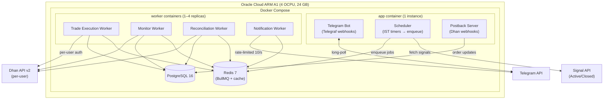
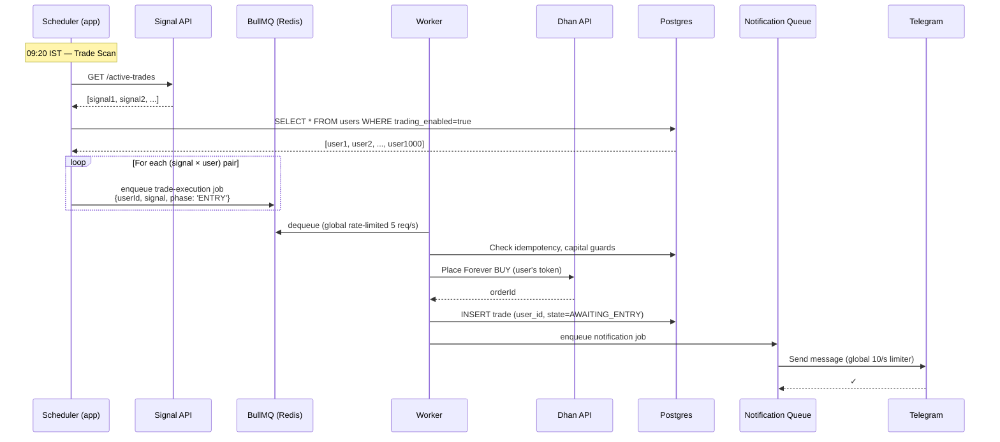
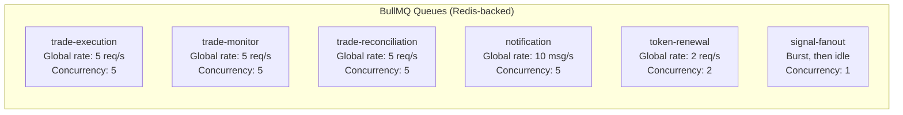
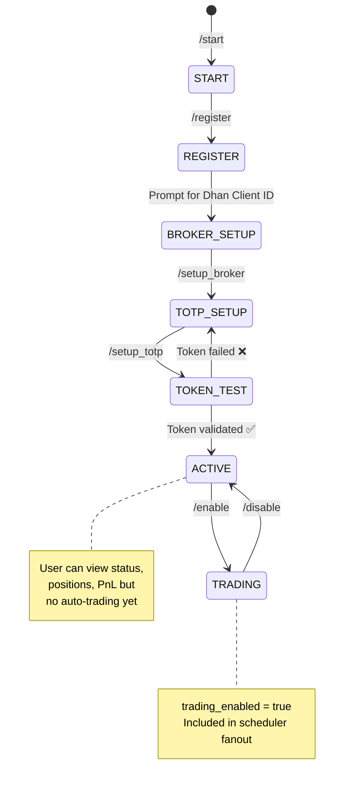

# Multi-Tenant SaaS Trading Platform — System Design

Evolving `stocks-signal-executor` from a single-user Node.js trading bot into a multi-tenant SaaS platform supporting 1000+ concurrent users. Core business logic (6-phase trade lifecycle, state machine, safeguards S1–S5) is preserved.

---

## 1. Architecture Overview

### Architecture Style: **Modular Monolith with Worker Separation**

> [!IMPORTANT]
> **Why not microservices?** On Oracle Free Tier (4 OCPU, 24GB RAM, single VM), microservices add Docker networking overhead, inter-service latency, distributed tracing complexity, and operational burden — all without proportional benefit at 1000 users. A modular monolith with clearly separated processes gives us independent scaling of workers without the operational tax.

The system runs as **3 Docker containers** sharing a Postgres instance and Redis:

| Container    | Role                                                         | Scaling                                      |
| ------------ | ------------------------------------------------------------ | -------------------------------------------- |
| **`app`**    | Telegram bot + Scheduler (timer-only, enqueues jobs)         | 1 instance (Telegram webhooks are singleton) |
| **`worker`** | BullMQ workers (trade execution, monitoring, reconciliation) | 1–4 replicas                                 |
| **`infra`**  | Postgres + Redis                                             | 1 instance each                              |



### Data Flow: Signal → Execution → Notification



---

## 2. Component Design

### Module Map (within the monolith)

```
src/
├── config/                    # Zod schema, env loader (UNCHANGED)
├── enums/                     # TradeState, LifecycleEvents (UNCHANGED)
├── models/                    # ActiveTrade, ClosedTrade (UNCHANGED)
├── utils/                     # retry, encryption helpers
│
├── modules/
│   ├── user/                  # NEW — User management
│   │   ├── userService.ts     #   CRUD, onboarding, preferences
│   │   └── userRepository.ts  #   Postgres queries
│   │
│   ├── auth/                  # EVOLVED — Per-user token management
│   │   ├── tokenService.ts    #   Same logic, now scoped by userId
│   │   └── credentialVault.ts #   AES-256-GCM encryption at rest
│   │
│   ├── signal/                # EVOLVED — Signal ingestion + fanout
│   │   ├── signalProcessor.ts #   Fetch → dedupe → enqueue per user
│   │   └── tradeSyncService.ts#   Same normalize logic
│   │
│   ├── trade/                 # PRESERVED — Core business logic
│   │   ├── tradeEntryService.ts    # Phase 2 (UNCHANGED logic)
│   │   ├── tradeMonitorService.ts  # Phase 3+5 (UNCHANGED logic)
│   │   ├── tradeReconciliationService.ts # Phase 4+6 (UNCHANGED)
│   │   ├── tradeHelpers.ts         # S1-S5 safeguards (UNCHANGED)
│   │   ├── quantityResolverService.ts
│   │   └── tslService.ts
│   │
│   ├── broker/                # EVOLVED — Per-user broker client
│   │   ├── brokerInterface.ts #   Abstract interface (future multi-broker)
│   │   └── dhanService.ts     #   Implements BrokerInterface, user-scoped tokens
│   │
│   ├── notification/          # EVOLVED — Queue-based notifications
│   │   ├── notificationService.ts  # Enqueue instead of direct send
│   │   └── telegramWorker.ts       # Dequeue at 10 msg/s
│   │
│   ├── portfolio/             # NEW — Cross-user portfolio views
│   │   └── portfolioService.ts
│   │
│   └── scheduler/             # EVOLVED — Fan-out scheduler
│       ├── scheduler.ts       #   Same IST timers, now enqueues jobs
│       └── phaseOrchestrator.ts
│
├── queues/                    # NEW — BullMQ definitions
│   ├── queueRegistry.ts       #   Queue factory + names
│   └── jobs.ts                #   Job type definitions
│
├── workers/                   # NEW — BullMQ worker processes
│   ├── tradeExecutionWorker.ts
│   ├── monitorWorker.ts
│   ├── reconciliationWorker.ts
│   ├── notificationWorker.ts
│   └── tokenRenewalWorker.ts
│
├── telegram/                  # EVOLVED — Multi-user bot
│   ├── telegramService.ts     #   User-scoped commands
│   ├── handlers/              #   Command handlers
│   │   ├── onboardingHandler.ts
│   │   ├── tradingHandler.ts
│   │   ├── portfolioHandler.ts
│   │   └── configHandler.ts
│   └── middleware/
│       └── userResolver.ts    #   telegram_chat_id → user lookup
│
├── services/                  # Shared infrastructure
│   ├── auditLogService.ts     #   UNCHANGED logic
│   ├── configService.ts       #   Now per-user overrides
│   ├── holidayService.ts      #   UNCHANGED
│   ├── instrumentLookupService.ts  # UNCHANGED
│   └── stateStore.ts          #   Pool-based (pg.Pool instead of Client)
│
└── index.ts                   # Bootstrap (app container)
    workerMain.ts              # Bootstrap (worker containers)
```

### What Changes vs. What's Preserved

| Component                  | Change Level           | Details                                                                                                                                               |
| -------------------------- | ---------------------- | ----------------------------------------------------------------------------------------------------------------------------------------------------- |
| TradeEntryService          | **Logic UNCHANGED**    | Now receives `userId` + user's `DhanService` instance. Same validation, capital guards, Forever order placement.                                      |
| TradeMonitorService        | **Logic UNCHANGED**    | Same monitor loop. Receives user-scoped DhanService + store queries filtered by `user_id`.                                                            |
| TradeReconciliationService | **Logic UNCHANGED**    | Same 4 reconciliation paths. User-scoped.                                                                                                             |
| TradeHelpers (S1–S5)       | **UNCHANGED**          | Atomic sell guard, idempotency, symbol fallback — all work identically. The `user_id` column on `trades` is the only schema change.                   |
| DhanService                | **Structurally same**  | Same HTTP client + auth retry. Now instantiated per-user with that user's token.                                                                      |
| TokenService               | **Same logic, scoped** | Same TOTP gen, renewal, validation. Tokens stored in **Redis only** (`token:{userId}`, TTL 24h). No DB table — TOTP auto-gen is the durable fallback. |
| Scheduler                  | **Evolved**            | Same IST timers. Instead of directly executing phases, it **enqueues BullMQ jobs** for each active user.                                              |
| TelegramService            | **Evolved**            | Multi-user command handling. User identified by `telegram_chat_id`.                                                                                   |
| AuditLogService            | **UNCHANGED**          | Same level-based routing. `audit_logs.user_id` added.                                                                                                 |
| ConfigService              | **Evolved**            | Global defaults + per-user overrides in `user_config` table.                                                                                          |

---

## 3. Queue & Rate Limiting Design

### 3.1 Queue Topology (BullMQ)



| Queue                  | Trigger                  | Rate Limit          | Concurrency | Retry                |
| ---------------------- | ------------------------ | ------------------- | ----------- | -------------------- |
| `signal-fanout`        | Scheduler @ 09:20 IST    | None (runs once)    | 1           | 3× / 500ms backoff   |
| `trade-execution`      | signal-fanout completion | **5 req/s global**  | 5           | 3× / 1s exp. backoff |
| `trade-monitor`        | Scheduler @ 10:00–15:00  | **5 req/s global**  | 5           | 3× / 1s exp. backoff |
| `trade-reconciliation` | Scheduler @ 14:30, 16:00 | **5 req/s global**  | 5           | 3× / 2s exp. backoff |
| `notification`         | Any service              | **10 msg/s global** | 5           | 5× / 2s exp. backoff |
| `token-renewal`        | Scheduler @ 06:00 IST    | **2 req/s global**  | 2           | 3× / 5s exp. backoff |

### 3.2 Job Structure

```typescript
// Base job interface — all jobs carry userId for tenant isolation
interface BaseJob {
  userId: number;
  traceId: string; // UUID for distributed tracing
  enqueuedAt: string; // ISO timestamp
}

// Signal fanout: runs once, enqueues per-user trade-execution jobs
interface SignalFanoutJob extends BaseJob {
  phase: "ACTIVE_SCAN" | "CLOSED_SCAN";
  signals: ActiveTrade[] | ClosedTrade[]; // pre-fetched by scheduler
}

// Trade execution: one job per user per signal
interface TradeExecutionJob extends BaseJob {
  phase: "ENTRY";
  signal: ActiveTrade;
}

// Monitor: one job per user per monitor cycle
interface TradeMonitorJob extends BaseJob {
  phase: "PENDING_ENTRIES" | "ENTERED_TRADES";
}

// Reconciliation: one job per user
interface ReconciliationJob extends BaseJob {
  phase: "CLOSED_TRADES" | "POSITION_RECONCILE";
  closedSignals?: ClosedTrade[]; // only for CLOSED_TRADES phase
}

// Notification: one message per job
interface NotificationJob extends BaseJob {
  chatId: string;
  text: string;
  parseMode?: "MarkdownV2" | "HTML";
  channel: "default" | "trades"; // which chat to send to
}

// Token renewal: one job per user
interface TokenRenewalJob extends BaseJob {
  action: "PROACTIVE_RENEW" | "GENERATE_TOTP" | "VALIDATE";
}
```

### 3.3 Job ID Strategy (Idempotent Enqueueing)

```typescript
// BullMQ deduplicates by jobId — same ID = same job, won't re-enqueue
const jobId = `${queue}:${userId}:${phase}:${dateKey}`;

// Examples:
// "trade-execution:42:ENTRY:2026-04-15:signal-1234"
// "trade-monitor:42:PENDING_ENTRIES:2026-04-15:10:00"
// "notification:42:BUY_PLACED:order-5678"
```

This replaces the current `idempotency` table for job deduplication (the table is still used for order placement idempotency within the worker — safeguard S2 is unchanged).

### 3.4 Retry Strategy

```typescript
const RETRY_CONFIG = {
  "trade-execution": {
    attempts: 3,
    backoff: { type: "exponential", delay: 1000 }, // 1s, 2s, 4s
    removeOnComplete: { age: 86400 }, // keep 24h
    removeOnFail: { age: 604800 }, // keep 7 days for debugging
  },
  "trade-monitor": {
    attempts: 3,
    backoff: { type: "exponential", delay: 1000 },
    removeOnComplete: { age: 3600 }, // 1h (runs hourly)
  },
  notification: {
    attempts: 5,
    backoff: { type: "exponential", delay: 2000 }, // 2s, 4s, 8s, 16s, 32s
    removeOnComplete: { age: 3600 },
  },
  "token-renewal": {
    attempts: 3,
    backoff: { type: "exponential", delay: 5000 }, // 5s, 10s, 20s
  },
};
```

### 3.5 Rate Limiting Strategy

All rate limiting uses **BullMQ's built-in `limiter`** — global per queue. No custom per-user rate limiting.

> [!NOTE]
> Per-user rate limiting was considered but rejected for simplicity. The global limit is safer (protects the shared Dhan infrastructure endpoint) and far simpler to implement and debug. If a single user's burst is being unfairly throttled by another user's jobs, we can revisit with per-user queues later.

#### Dhan API Rate Limiting (5 req/s global)

```typescript
// All Dhan-facing queues share the same global rate limit.
// BullMQ's limiter handles this natively — no custom code needed.

const tradeExecutionWorker = new Worker("trade-execution", processor, {
  concurrency: 5,
  limiter: {
    max: 5,
    duration: 1000, // 5 jobs per 1000ms = 5 req/s to Dhan
  },
});

const monitorWorker = new Worker("trade-monitor", processor, {
  concurrency: 5,
  limiter: {
    max: 5,
    duration: 1000,
  },
});

const reconciliationWorker = new Worker("trade-reconciliation", processor, {
  concurrency: 5,
  limiter: {
    max: 5,
    duration: 1000,
  },
});
```

#### Telegram Rate Limiting (10 msg/s global)

```typescript
const notificationWorker = new Worker("notification", processor, {
  concurrency: 5,
  limiter: {
    max: 10,
    duration: 1000, // 10 jobs per 1000ms = 10 msg/s
  },
});
```

#### Token Renewal Rate Limiting (2 req/s global)

```typescript
const tokenRenewalWorker = new Worker("token-renewal", processor, {
  concurrency: 2,
  limiter: {
    max: 2,
    duration: 1000, // 2 req/s — low priority, non-urgent
  },
});
```

> [!TIP]
> With global rate limiting, all queue workers are self-throttling via BullMQ internals (Redis-backed). Zero custom rate-limiting code to write or maintain.

---

## 4. Data Model

### 4.1 Multi-Tenant Strategy: **Shared Schema with `user_id` FK**

> [!NOTE]
> At 1000 users, schema-per-tenant (1000 schemas) is operationally unmanageable. Database-per-tenant is even worse. A shared schema with `user_id` column + application-level enforcement is the standard approach at this scale.

### 4.2 Schema Changes

#### New Tables

```sql
-- ═══════════════════════════════════════════════════
-- USERS — Central tenant table
-- ═══════════════════════════════════════════════════
CREATE TABLE users (
  id             BIGSERIAL PRIMARY KEY,
  telegram_chat_id TEXT NOT NULL UNIQUE,     -- Primary identifier
  telegram_username TEXT,
  display_name   TEXT,

  -- Broker credentials (AES-256-GCM encrypted)
  dhan_client_id       TEXT,                  -- Plaintext (not secret)
  dhan_credentials_enc BYTEA,                 -- Encrypted JSON blob: {pin, totpSecret}
  dhan_credentials_iv  BYTEA,                 -- AES initialization vector

  -- User state
  status         TEXT NOT NULL DEFAULT 'ONBOARDING'
                   CHECK (status IN ('ONBOARDING','ACTIVE','PAUSED','SUSPENDED')),
  trading_enabled BOOLEAN NOT NULL DEFAULT FALSE,
  onboarded_at   TIMESTAMPTZ,

  created_at     TIMESTAMPTZ NOT NULL DEFAULT NOW(),
  updated_at     TIMESTAMPTZ NOT NULL DEFAULT NOW()
);
CREATE INDEX idx_users_telegram ON users (telegram_chat_id);
CREATE INDEX idx_users_status ON users (status);

-- ═══════════════════════════════════════════════════
-- USER_CONFIG — Per-user trading config overrides
-- ═══════════════════════════════════════════════════
CREATE TABLE user_config (
  user_id    BIGINT NOT NULL REFERENCES users(id),
  key        TEXT NOT NULL,
  value      TEXT NOT NULL,
  updated_at TIMESTAMPTZ NOT NULL DEFAULT NOW(),
  PRIMARY KEY (user_id, key)
);

-- ═══════════════════════════════════════════════════
-- USER_SIGNALS — Which signals each user subscribes to
-- ═══════════════════════════════════════════════════
CREATE TABLE user_signal_subscriptions (
  user_id        BIGINT NOT NULL REFERENCES users(id),
  signal_source  TEXT NOT NULL DEFAULT 'default',  -- future: multiple signal providers
  enabled        BOOLEAN NOT NULL DEFAULT TRUE,
  created_at     TIMESTAMPTZ NOT NULL DEFAULT NOW(),
  PRIMARY KEY (user_id, signal_source)
);
```

#### Modified Tables (add `user_id` column)

```sql
-- trades: add user_id + composite unique constraint
ALTER TABLE trades ADD COLUMN user_id BIGINT NOT NULL REFERENCES users(id);
ALTER TABLE trades DROP CONSTRAINT trades_pkey;
ALTER TABLE trades ADD PRIMARY KEY (id, user_id);
-- The 'id' now comes from the signal (reco_id), not auto-generated.
-- Same signal can create different trades for different users.
CREATE INDEX idx_trades_user_state ON trades (user_id, state);

-- idempotency: scope by user
ALTER TABLE idempotency ADD COLUMN user_id BIGINT NOT NULL REFERENCES users(id);
ALTER TABLE idempotency DROP CONSTRAINT idempotency_pkey;
ALTER TABLE idempotency ADD PRIMARY KEY (user_id, action_key);

-- token_store: REMOVED — tokens are ephemeral (24h) and stored in Redis only.
-- TOTP secrets in users.dhan_credentials_enc serve as the durable regeneration path.
-- DROP TABLE IF EXISTS token_store;

-- audit_logs: add user_id (nullable for system events)
ALTER TABLE audit_logs ADD COLUMN user_id BIGINT REFERENCES users(id);
CREATE INDEX idx_audit_user ON audit_logs (user_id, created_at DESC);

-- pnl_records: add user_id
ALTER TABLE pnl_records ADD COLUMN user_id BIGINT NOT NULL REFERENCES users(id);
CREATE INDEX idx_pnl_user ON pnl_records (user_id, exited_at DESC);

-- reco_scan_log: add user_id
ALTER TABLE reco_scan_log ADD COLUMN user_id BIGINT NOT NULL REFERENCES users(id);

-- postback_log: add user_id (nullable, resolved on processing)
ALTER TABLE postback_log ADD COLUMN user_id BIGINT REFERENCES users(id);

-- app_config: remains global (system defaults)
-- User overrides go in user_config table
```

#### Unchanged Tables

| Table                    | Why Unchanged                                           |
| ------------------------ | ------------------------------------------------------- |
| `instrument_list_nse_eq` | Global instrument catalog — same for all users          |
| `market_holidays`        | Global calendar — same for all users                    |
| `app_config`             | System-wide defaults (users override via `user_config`) |

### 4.3 Complete ERD

```mermaid
erDiagram
    users ||--o{ trades : "has"

    users ||--o{ user_config : "has"
    users ||--o{ user_signal_subscriptions : "subscribes"
    users ||--o{ audit_logs : "generates"
    users ||--o{ pnl_records : "has"
    users ||--o{ idempotency : "scoped"

    users {
        bigint id PK
        text telegram_chat_id UK
        text dhan_client_id
        bytea dhan_credentials_enc
        text status
        boolean trading_enabled
    }

    trades {
        bigint id PK
        bigint user_id FK
        text state
        text symbol
        numeric entry_price
        integer quantity
        text buy_order_id
        text sell_order_id
    }


    user_config {
        bigint user_id PK_FK
        text key PK
        text value
    }

    app_config {
        text key PK
        text value
    }

    instrument_list_nse_eq {
        bigint id PK
        text security_id
        text underlying_symbol
    }
```

---

## 5. Redis Usage

Redis serves two distinct roles:

| Role               | Keys Pattern                 | TTL               | Purpose                                                                                                                             |
| ------------------ | ---------------------------- | ----------------- | ----------------------------------------------------------------------------------------------------------------------------------- |
| **BullMQ backing** | `bull:*`                     | Managed by BullMQ | Job queues, delayed jobs, rate limiter state, completed/failed sets                                                                 |
| **Token store**    | `token:{userId}`             | 24h               | **Primary store** for Dhan access tokens. No DB table — Redis is the sole storage. If evicted, TOTP auto-gen recreates on next use. |
| **Idempotency**    | `idemp:{userId}:{actionKey}` | 24h               | Fast-path idempotency check before DB (reduces DB load)                                                                             |
| **User session**   | `user:{telegramChatId}`      | 1h                | Cached user record for Telegram command handling                                                                                    |

> [!NOTE]
> Rate limiting is handled entirely within BullMQ internals (Redis-backed but managed by BullMQ) — no custom rate-limit keys needed.

### Memory Estimation (1000 users)

| Key Type                       | Count | Size Each | Total    |
| ------------------------------ | ----- | --------- | -------- |
| Token cache                    | 1000  | ~2KB      | 2MB      |
| Idempotency                    | ~5000 | ~100B     | 500KB    |
| User sessions                  | 1000  | ~500B     | 500KB    |
| BullMQ (active jobs + limiter) | ~5000 | ~1KB      | 5MB      |
| **Total**                      |       |           | **~8MB** |

> [!TIP]
> Redis memory usage is negligible. Oracle Free Tier has 24GB RAM — Redis will use < 0.1%.

---

## 6. Scheduler Evolution

### Current: Direct Execution

```
09:20 → Scheduler.enqueueTradeEntry()    → runs inline, single user
10:00 → Scheduler.executePendingEntry() → runs inline, single user
```

### New: Enqueue-Only Scheduler

```
09:20 → Scheduler.enqueueTradeScan()
         │
         ├─ 1. Fetch signals from API (single HTTP call)
         ├─ 2. SELECT * FROM users WHERE trading_enabled=true AND status='ACTIVE'
         └─ 3. For each user: signalFanoutQueue.add({userId, signals})
              │
              └─ Worker picks up → for each signal:
                   tradeExecutionQueue.add({userId, signal, phase:'ENTRY'})
                   │
                   └─ Worker picks up (rate-limited per user):
                        → TradeEntryService.runBuyAndInitialSl()  ← UNCHANGED LOGIC
```

```typescript
// scheduler.ts (evolved)
class Scheduler {
  // IST timers remain identical — only the execute* methods change

  private async enqueueTradeScan(): Promise<void> {
    const signals = await this.tradeSyncService.fetchActiveTrades();
    if (signals.length === 0) return;

    const users = await this.userService.getActiveUsers();

    for (const user of users) {
      await this.signalFanoutQueue.add(
        "trade-scan",
        { userId: user.id, signals, phase: "ACTIVE_SCAN" },
        {
          jobId: `signal-fanout:${user.id}:ACTIVE_SCAN:${todayKey()}`,
          removeOnComplete: { age: 86400 },
        },
      );
    }

    await this.audit.info(LifecycleEvents.DHAN_API_CALL, {
      action: "Scheduler.enqueueTradeScan",
      message: `Enqueued trade scan for ${users.length} users, ${signals.length} signals`,
    });
  }

  private async enqueueMonitor(phase: "PENDING_ENTRIES" | "ENTERED_TRADES"): Promise<void> {
    const users = await this.userService.getActiveUsers();
    const timeSlot = DateTime.now().setZone("Asia/Kolkata").toFormat("HHmm");

    for (const user of users) {
      await this.monitorQueue.add(
        "monitor",
        { userId: user.id, phase },
        { jobId: `monitor:${user.id}:${phase}:${todayKey()}:${timeSlot}` },
      );
    }
  }
}
```

### Capacity Analysis: Can We Process 1000 Users In Time?

With a **global 5 req/s** rate limit on Dhan-facing queues:

| Phase              | API Calls per User                  | Total Calls (1000 users) | At 5 req/s global | Time      |
| ------------------ | ----------------------------------- | ------------------------ | ----------------- | --------- |
| Trade Scan (09:20) | 1 Forever Order                     | 1000                     | 5 req/s           | ~3.3 min  |
| Pending Monitor    | 3 (forever, orders, match)          | 3000                     | 5 req/s           | ~10 min   |
| Entered Monitor    | 2 (holdings, sell)                  | 2000                     | 5 req/s           | ~6.7 min  |
| Reconciliation     | 4 (holdings, forever, orders, sell) | 4000                     | 5 req/s           | ~13.3 min |

> [!TIP]
> All phases complete well within their hourly windows (trade scan has 40 min before first monitor; monitors are spaced 1h apart; reconciliation has unlimited time after market close). At 500 users the times halve. If throughput becomes an issue at scale, the global rate limit can be increased (Dhan's actual limit may be higher) or split into per-user queues.

> [!IMPORTANT]
> **Global rate limit trade-off**: With 1000 users and global 5 req/s, a monitor cycle takes ~10 min instead of ~45s. This is acceptable because: (a) monitors run hourly with a 1h window, (b) CNC trades settle T+1 so minutes don't matter, (c) the alternative (per-user rate limiting) adds significant Redis complexity.

---

## 7. Telegram Multi-User Evolution

### User Resolution Middleware

```typescript
// Every incoming Telegram message → resolve to user record
bot.use(async (ctx, next) => {
  const chatId = String(ctx.chat?.id);

  // Fast path: Redis cache
  let user = await redis.get(`user:${chatId}`);
  if (!user) {
    // Slow path: DB lookup
    const result = await pg.query("SELECT * FROM users WHERE telegram_chat_id = $1", [chatId]);
    if (result.rows[0]) {
      user = result.rows[0];
      await redis.set(`user:${chatId}`, JSON.stringify(user), "EX", 3600);
    }
  }

  ctx.state.user = user; // null for unregistered users
  return next();
});
```

### Command Routing

| Command                     | Auth Required | Handler                                            |
| --------------------------- | ------------- | -------------------------------------------------- |
| `/start`                    | No            | Begins onboarding flow                             |
| `/register`                 | No            | Creates user + prompts for Dhan client ID          |
| `/setup_broker <client_id>` | Onboarding    | Stores Dhan client ID                              |
| `/setup_totp <secret>`      | Onboarding    | Stores encrypted TOTP secret, generates test token |
| `/token <access_token>`     | Yes           | Same as current — validates + stores               |
| `/enable`                   | Yes           | Sets `trading_enabled=true`                        |
| `/disable`                  | Yes           | Sets `trading_enabled=false`                       |
| `/status`                   | Yes           | Token validity + active trades count               |
| `/positions`                | Yes           | Open trades with current LTP                       |
| `/pnl`                      | Yes           | Realized P&L summary                               |
| `/config`                   | Yes           | View/update per-user config                        |
| `/trade`                    | Yes           | Manual trade scan (enqueues for this user only)    |
| `/monitor`                  | Yes           | Manual monitor trigger                             |

### Onboarding Flow



---

## 8. Security Design

### 8.1 Credential Encryption at Rest

```typescript
// CredentialVault: Envelope encryption for broker secrets
//
// KEK (Key Encryption Key): Derived from MASTER_SECRET env var + user_id
// DEK (Data Encryption Key): Random per-user, encrypted by KEK
// Credentials encrypted by DEK using AES-256-GCM

class CredentialVault {
  // Encrypt: credentials → {encryptedBlob, iv}
  async encrypt(
    userId: number,
    credentials: BrokerCredentials,
  ): Promise<{ enc: Buffer; iv: Buffer }> {
    const kek = this.deriveKEK(userId);
    const iv = crypto.randomBytes(16);
    const cipher = crypto.createCipheriv("aes-256-gcm", kek, iv);

    const plaintext = JSON.stringify(credentials); // {pin, totpSecret}
    const encrypted = Buffer.concat([cipher.update(plaintext, "utf8"), cipher.final()]);
    const authTag = cipher.getAuthTag();

    return { enc: Buffer.concat([encrypted, authTag]), iv };
  }

  // Decrypt: {encryptedBlob, iv} → credentials
  async decrypt(userId: number, enc: Buffer, iv: Buffer): Promise<BrokerCredentials> {
    const kek = this.deriveKEK(userId);
    const authTag = enc.subarray(-16);
    const ciphertext = enc.subarray(0, -16);

    const decipher = crypto.createDecipheriv("aes-256-gcm", kek, iv);
    decipher.setAuthTag(authTag);

    const decrypted = Buffer.concat([decipher.update(ciphertext), decipher.final()]);
    return JSON.parse(decrypted.toString("utf8"));
  }

  private deriveKEK(userId: number): Buffer {
    return crypto.pbkdf2Sync(
      process.env.MASTER_ENCRYPTION_KEY!,
      `user:${userId}`,
      100000,
      32,
      "sha256",
    );
  }
}
```

### 8.2 Tenant Isolation

| Layer           | Mechanism                                                                      |
| --------------- | ------------------------------------------------------------------------------ |
| **Database**    | Every query includes `WHERE user_id = $N`. No shared data between users.       |
| **Redis**       | Keys namespaced: `token:{userId}`, `idemp:{userId}:{key}`                      |
| **BullMQ Jobs** | Every job carries `userId`. Workers create user-scoped service instances.      |
| **Telegram**    | User resolved from `telegram_chat_id`. Commands only operate on caller's data. |
| **DhanService** | Instantiated per-job with the user's own token. Never shared between users.    |
| **Audit Logs**  | `user_id` column enables per-tenant log filtering.                             |

### 8.3 Token Handling

- Dhan access tokens stored **only in Redis** (`token:{userId}`, TTL 24h) — no DB table
- If Redis evicts a token (unlikely) or restarts, TOTP auto-gen recreates it on next API call
- TOTP secrets encrypted at rest via CredentialVault
- Tokens never logged (masked in audit: `eyJhb***last4`)
- Token renewal jobs run via low-priority BullMQ queue

---

## 9. Scaling Strategy

### 9.1 Oracle Free Tier Resource Plan

```
┌─────────────────────────────────────────────────────┐
│  Oracle ARM A1: 4 OCPU, 24 GB RAM                  │
│                                                     │
│  ┌──────────┐  ┌──────────┐  ┌──────────┐          │
│  │ app      │  │ worker-1 │  │ worker-2 │          │
│  │ 1 OCPU   │  │ 1 OCPU   │  │ 1 OCPU   │          │
│  │ 4 GB     │  │ 4 GB     │  │ 4 GB     │          │
│  │          │  │          │  │          │  ┌──────┐ │
│  │ Telegram │  │ Trade    │  │ Monitor  │  │ PG   │ │
│  │ Scheduler│  │ Exec     │  │ Recon    │  │ 1OCPU│ │
│  │ Postback │  │ Workers  │  │ Workers  │  │ 6 GB │ │
│  └──────────┘  └──────────┘  └──────────┘  │Redis │ │
│                                            │ 2 GB │ │
│                                            └──────┘ │
└─────────────────────────────────────────────────────┘
```

### 9.2 Docker Compose (Production)

```yaml
services:
  # ── App: Telegram bot + Scheduler (singleton) ──
  app:
    build: .
    command: ["node", "dist/index.js"]
    environment:
      ROLE: app
    deploy:
      replicas: 1
      resources:
        limits: { cpus: "1", memory: "4G" }
    depends_on:
      postgres: { condition: service_healthy }
      redis: { condition: service_healthy }
    restart: unless-stopped

  # ── Workers: BullMQ job processors (scalable) ──
  worker:
    build: .
    command: ["node", "dist/workerMain.js"]
    environment:
      ROLE: worker
      WORKER_CONCURRENCY: 20
    deploy:
      replicas: 2 # Scale to 4 if needed
      resources:
        limits: { cpus: "1", memory: "4G" }
    depends_on:
      postgres: { condition: service_healthy }
      redis: { condition: service_healthy }
    restart: unless-stopped

  # ── Postgres ──
  postgres:
    image: postgres:16-alpine
    volumes: ["postgres-data:/var/lib/postgresql/data"]
    environment:
      POSTGRES_DB: stocks_executor
      SHARED_BUFFERS: 2GB
      EFFECTIVE_CACHE_SIZE: 4GB
      WORK_MEM: 16MB
    deploy:
      resources:
        limits: { cpus: "1", memory: "6G" }
    healthcheck:
      test: ["CMD-SHELL", "pg_isready"]
      interval: 10s
    restart: unless-stopped

  # ── Redis ──
  redis:
    image: redis:7-alpine
    command: ["redis-server", "--maxmemory", "1gb", "--maxmemory-policy", "allkeys-lru"]
    volumes: ["redis-data:/data"]
    deploy:
      resources:
        limits: { cpus: "0.5", memory: "2G" }
    healthcheck:
      test: ["CMD", "redis-cli", "ping"]
      interval: 10s
    restart: unless-stopped

volumes:
  postgres-data:
  redis-data:
```

### 9.3 Horizontal Scaling Path

| Users     | Workers             | Infra Notes                                   |
| --------- | ------------------- | --------------------------------------------- |
| 1–100     | 1 worker replica    | Current Oracle Free Tier is sufficient        |
| 100–500   | 2 worker replicas   | Monitor Redis memory, tune PG connections     |
| 500–1000  | 2–3 worker replicas | Add PG connection pooling (PgBouncer)         |
| 1000–2000 | 4 worker replicas   | May need to move PG to managed service        |
| 2000+     | Multiple VMs        | Split to Oracle + GCP free tier, or paid tier |

### 9.4 Connection Pooling

> [!WARNING]
> The current `StateStore` uses `pg.Client` (single connection). At 1000 users with 20 concurrent workers, this must change to `pg.Pool`.

```typescript
// stateStore.ts — evolved
import { Pool } from "pg";

export class StateStore {
  readonly pool: Pool;

  constructor(cfg: AppConfig) {
    this.pool = new Pool({
      host: cfg.postgres.host,
      port: cfg.postgres.port,
      database: cfg.postgres.database,
      user: cfg.postgres.user,
      password: cfg.postgres.password,
      max: 30, // Max connections in pool
      idleTimeoutMillis: 30000,
      connectionTimeoutMillis: 5000,
    });
  }

  // Workers use pool.query() directly — no connect/disconnect needed
  async query(sql: string, params?: any[]) {
    return this.pool.query(sql, params);
  }
}
```

---

## 10. Failure Handling

### 10.1 Failure Scenarios & Mitigations

| Scenario                      | Impact                 | Mitigation                                                                                                                                                                     |
| ----------------------------- | ---------------------- | ------------------------------------------------------------------------------------------------------------------------------------------------------------------------------ |
| **Dhan API 401/403**          | User's token expired   | Same auto-refresh logic (TokenService unchanged). Token renewal job enqueued. Notify user via Telegram.                                                                        |
| **Dhan API 429 (rate limit)** | Requests throttled     | BullMQ global rate limiter (5 req/s) prevents this. If it still happens (burst), existing DhanService `withAuthRetry` handles 429 with 1s delay + retry (UNCHANGED logic).     |
| **Dhan API 5xx**              | Broker down            | BullMQ retry (3× exponential backoff). After exhaustion → audit.critical + Telegram alert. Trade stays in current state.                                                       |
| **Partial trade execution**   | BUY placed, sell fails | **S1 atomic sell guard prevents duplicates**. Failed sell → sell_order_id cleared → Path D reconciliation clears it → retry next monitor tick. (UNCHANGED from current logic.) |
| **Worker crash mid-job**      | Job lost               | BullMQ marks job as stalled → auto-retried by another worker. Uses `stalledInterval: 30000`.                                                                                   |
| **Redis crash**               | Queue state lost       | Redis AOF persistence enabled. On restart, BullMQ recovers pending jobs. Scheduler re-enqueues on next tick.                                                                   |
| **Postgres crash**            | All state lost         | Docker volume on persistent block storage. Daily `pg_dump` backups. Recovery: restore from backup.                                                                             |
| **Queue backlog**             | Jobs piling up         | BullMQ dashboard monitoring (Bull Board). Alert if queue depth > threshold. Drop stale jobs (TTL on jobs).                                                                     |
| **Telegram API down**         | Notifications lost     | Notification queue retries 5× with exponential backoff. If exhausted → job moves to failed set. User can check `/positions` when Telegram recovers.                            |
| **Signal API down**           | No new trades          | Scheduler phase simply fails (no signals to process). Next scheduled run retries. No data corruption.                                                                          |

### 10.2 Dead Letter Queue

```typescript
// Jobs that fail all retries go to DLQ for manual review
const tradeExecutionWorker = new Worker("trade-execution", processor, {
  settings: {
    stalledInterval: 30000, // Check for stalled jobs every 30s
    maxStalledCount: 2, // Allow 2 stall recoveries before failing
  },
});

tradeExecutionWorker.on("failed", async (job, err) => {
  if (job && job.attemptsMade >= job.opts.attempts!) {
    // Move to DLQ
    await dlqQueue.add("trade-execution-dlq", {
      originalJob: job.data,
      error: err.message,
      failedAt: new Date().toISOString(),
    });

    // Alert via Telegram
    await notificationQueue.add("dlq-alert", {
      userId: job.data.userId,
      text:
        `🚨 Trade execution failed permanently after ${job.attemptsMade} attempts.\n` +
        `Error: ${err.message}\n` +
        `Manual review required.`,
      channel: "default",
    });
  }
});
```

### 10.3 Circuit Breaker for Dhan API

```typescript
// Global circuit breaker — if Dhan API is down, stop all workers
// from hammering it. Simpler than per-user since rate limiting is global.
class DhanCircuitBreaker {
  // States: CLOSED (normal) → OPEN (failing) → HALF_OPEN (testing)
  // Redis key: circuit:dhan:global

  private readonly FAILURE_THRESHOLD = 10; // 10 consecutive failures → OPEN
  private readonly RESET_TIMEOUT_MS = 60000; // 1 min → HALF_OPEN

  async execute<T>(fn: () => Promise<T>): Promise<T> {
    const state = await this.getState();

    if (state === "OPEN") {
      throw new Error("Circuit breaker OPEN — Dhan API temporarily unavailable");
    }

    try {
      const result = await fn();
      await this.recordSuccess();
      return result;
    } catch (err) {
      await this.recordFailure();
      throw err;
    }
  }
}
```

---

## 11. Trade-offs & Assumptions

### Trade-offs Made

| Decision                                    | Trade-off                                                  | Rationale                                                                                                                                                                                                                  |
| ------------------------------------------- | ---------------------------------------------------------- | -------------------------------------------------------------------------------------------------------------------------------------------------------------------------------------------------------------------------- |
| **Modular monolith over microservices**     | Harder to scale individual modules independently           | Single VM constraint. Monolith is simpler to deploy, debug, and operate. Worker separation gives us the scaling lever we need.                                                                                             |
| **Shared DB schema over schema-per-tenant** | No physical isolation between tenants                      | 1000 users in separate schemas = 1000× migration overhead. Application-level `user_id` filtering is standard at this scale.                                                                                                |
| **Global rate limiting over per-user**      | At 1000 users, a heavy phase takes ~10 min instead of ~45s | Eliminates custom Redis sliding-window code entirely. BullMQ's built-in limiter handles everything. CNC delivery trades don't need sub-second execution — minutes are acceptable. Can upgrade to per-user later if needed. |
| **Telegram-only over Web UI**               | Limited UX for complex flows                               | Matches the requirement. Web UI can be added later without architectural changes.                                                                                                                                          |
| **Polling for signals over WebSocket**      | Higher latency (minutes not seconds)                       | Signal API is external and HTTP-only. Polling at market-appropriate intervals is sufficient for CNC delivery trades.                                                                                                       |
| **Single Redis instance**                   | Single point of failure                                    | On Oracle Free Tier, running Redis Sentinel adds complexity without benefit. AOF persistence + Docker restart policy provides adequate durability.                                                                         |
| **BrokerInterface abstraction**             | Slight over-engineering for now                            | Dhan is the only broker today, but the user confirmed plans for multi-broker. A thin interface now avoids a painful refactor later.                                                                                        |
| **Free tier for all users**                 | No revenue                                                 | Planned for initial launch. Paid tiers with per-user trade limits/capital caps can be added via `user_config` + `users.plan` column later.                                                                                 |

### Assumptions

| #   | Assumption                                                                           | Impact If Wrong                                                                                                                                  |
| --- | ------------------------------------------------------------------------------------ | ------------------------------------------------------------------------------------------------------------------------------------------------ |
| 1   | **Signal API is shared** — single source, all users receive the same analyst signals | ✅ Confirmed by user. `user_signal_subscriptions` table supports future per-source routing.                                                      |
| 2   | **All users trade NSE Equities (CNC)** — no F&O, no intraday                         | If F&O needed, TradeEntryService needs exchange segment + product type resolution                                                                |
| 3   | **Dhan only for now, multi-broker later**                                            | ✅ Confirmed. BrokerInterface abstraction in place. DhanService implements it. Future brokers (Zerodha, Angel One) implement the same interface. |
| 4   | **Oracle Free Tier 4 OCPU / 24GB stays available**                                   | If Oracle reclaims, same Docker Compose runs on any Linux VM                                                                                     |
| 5   | **1000 users ≈ 5000-10000 active trades at any time**                                | If much higher, PG may need partitioning on `trades` table                                                                                       |
| 6   | **TOTP auto-generation preferred over manual token submission**                      | If most users do manual `/token`, token renewal queue is less critical                                                                           |
| 7   | **Market hours only (09:00–16:00 IST)** — no post-market trading                     | If after-hours needed, scheduler windows must expand                                                                                             |
| 8   | **Free for all users initially**                                                     | ✅ Confirmed. Paid tiers with trade limits can be added via `user_config` and a `users.plan` column.                                             |

### Migration Path from Current System

> [!IMPORTANT]
> The migration can be done incrementally without downtime:

| Step | Change                                                                    | Risk                                 |
| ---- | ------------------------------------------------------------------------- | ------------------------------------ |
| 1    | Add `users` table, seed with current single user                          | Zero risk — additive                 |
| 2    | Add `user_id` column to all tables (nullable initially, default = user 1) | Zero risk — backward compatible      |
| 3    | Add Redis + BullMQ to Docker Compose                                      | Zero risk — new containers           |
| 4    | Refactor Scheduler to enqueue instead of direct-execute                   | Medium — test thoroughly             |
| 5    | Add worker process with same trade logic                                  | Medium — test thoroughly             |
| 6    | Switch Telegram bot to multi-user mode                                    | Low — add user resolution middleware |
| 7    | Make `user_id` NOT NULL, add FK constraints                               | Low — backfill existing rows first   |
| 8    | Remove old direct-execution codepaths                                     | Low — after queue path is verified   |
